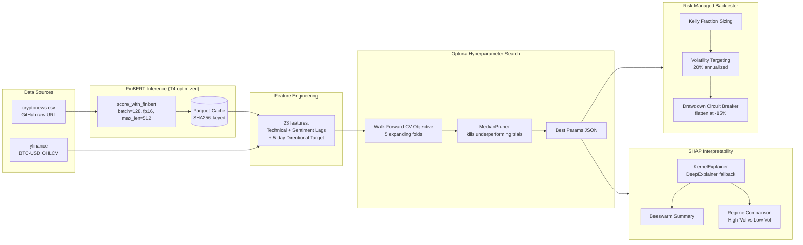

# BTC Sentiment-Driven LSTM Trading Pipeline

> A production-grade, end-to-end ML pipeline that fetches Bitcoin market data and crypto news, computes LLM-based sentiment scores, engineers technical + sentiment features, optimizes LSTM hyperparameters via Optuna walk-forward CV, backtests with Kelly position sizing + volatility targeting + drawdown circuit breaker, and explains model predictions with SHAP interpretability.

Built by **Nassim K.** — Business Analyst, Co-Founder of KINZ, SMU Alum. This project blends Data Analytics, Machine Learning, and secure data handling into a single reproducible pipeline.

---

## Table of Contents

1. [Pipeline Overview](#pipeline-overview)
2. [Architecture (Phase 2)](#architecture-phase-2)
3. [Tech Stack](#tech-stack)
4. [Repository Structure](#repository-structure)
5. [Phase 2 Upgrades](#phase-2-upgrades)
6. [Backtest Results](#backtest-results)
7. [SHAP Feature Importance](#shap-feature-importance)
8. [Reproducibility](#reproducibility)
9. [How to Run](#how-to-run)
10. [Roadmap](#roadmap)
11. [License](#license)

---

## Pipeline Overview

The pipeline answers one question: **can a sentiment-augmented LSTM beat a naive Buy & Hold strategy on BTC-USD after transaction costs, when risk is managed properly?**

It does so by combining two orthogonal signals:
- **Price-side features** — OHLCV candles from Yahoo Finance, augmented with RSI, MACD, Bollinger Bands, rolling volatility, and lagged log-returns.
- **News-side features** — Crypto news headlines scored by HuggingFace FinBERT (or TextBlob fallback), aggregated daily into a sentiment score and rolling sentiment momentum.

### Phase 1 (Foundation)
Data loading → LLM sentiment → Feature engineering → Manual 4-config LSTM grid → Simple backtester with threshold optimization.

### Phase 2 (Production-Grade Upgrades)
Walk-Forward CV → FinBERT with Parquet caching → Optuna hyperparameter search → Risk-managed backtester (Kelly + vol-targeting + DD breaker) → SHAP interpretability.

---

## Architecture (Phase 2)



---

## Tech Stack

| Layer              | Technology                                                  | Phase |
|--------------------|-------------------------------------------------------------|-------|
| Data ingestion     | `yfinance`, `pandas`, `requests`                            | 1     |
| Sentiment scoring  | `transformers` (FinBERT), `torch`                           | 1 + 2 |
| Feature engineering| `pandas`, `numpy`, `scikit-learn`                           | 1     |
| Walk-Forward CV    | `src.cv.walk_forward` (custom, 5 expanding folds)           | 2     |
| FinBERT caching    | `pyarrow` (Parquet, SHA256-keyed)                           | 2     |
| Hyperparameter opt | `optuna` (TPESampler + MedianPruner)                        | 2     |
| Modeling           | `tensorflow` (Keras LSTM)                                   | 1 + 2 |
| Risk management    | `src.backtest.risk_managed` (Kelly + vol-target + DD breaker)| 2    |
| Interpretability   | `shap` (KernelExplainer with DeepExplainer fallback)        | 2     |
| Visualization      | `matplotlib`, `seaborn`                                     | 1 + 2 |

---

## Repository Structure

```
btc-llm-sentiment/
├── README.md
├── requirements.txt
├── Data/
│   ├── cryptonews.csv                          # 31,037 headlines
│   └── bitcoin_sentiments_21_24.csv
├── notebooks/
│   ├── Master_Pipeline.ipynb                   # 🚀 1-click full pipeline (01-05 combined)
│   ├── 01_data_loading.ipynb                   # Phase 1
│   ├── 02_sentiment_llm.ipynb                  # Phase 1 (+ memory cleanup)
│   ├── 03_feature_engineering.ipynb            # Phase 1
│   ├── 04_lstm_finetuning.ipynb                # Phase 1 (+ memory cleanup)
│   ├── 05_evaluation_backtesting.ipynb         # Phase 1
│   ├── 06_walk_forward_cv.ipynb                # Phase 2 — Step 1
│   ├── 07_finbert_inference.ipynb              # Phase 2 — Step 2
│   ├── 08_optuna_search.ipynb                  # Phase 2 — Step 3
│   ├── 09_risk_managed_backtest.ipynb          # Phase 2 — Step 4
│   └── 10_shap_interpretability.ipynb          # Phase 2 — Step 5
├── src/                                        # Phase 2 modular package
│   ├── cv/
│   │   ├── walk_forward.py                     # Expanding-window CV
│   │   └── optuna_search.py                    # HPO with MedianPruner
│   ├── inference/
│   │   └── finbert.py                          # T4-optimized + Parquet cache
│   ├── models/
│   │   └── lstm.py                             # Parametric LSTM factory
│   ├── backtest/
│   │   └── risk_managed.py                     # Kelly + vol-target + DD breaker
│   └── interpretability/
│       └── shap_explainer.py                   # SHAP beeswarm + regime comparison
├── scripts/
│   ├── run_pipeline.py                         # Phase 1 end-to-end runner
│   ├── generate_interim_features.py            # Phase 2 feature bundle
│   ├── run_optuna_search.py                    # Phase 2 HPO runner
│   ├── run_risk_managed_backtest.py            # Phase 2 backtest runner
│   └── run_shap_analysis.py                    # Phase 2 SHAP runner
└── outputs/
    ├── complete_pipeline_summary.svg           # Phase 1
    ├── final_model_comparison.csv              # Phase 1
    ├── portfolio_values_over_time.csv          # Phase 1
    ├── trading_metrics.csv                     # Phase 1
    ├── best_optuna_params.json                 # Phase 2 — Step 3
    ├── risk_managed_backtest_results.csv       # Phase 2 — Step 4
    ├── risk_managed_equity_curve.csv           # Phase 2 — Step 4
    ├── strategy_comparison.csv                 # Phase 2 — Step 4
    ├── shap_summary.png                        # Phase 2 — Step 5
    ├── shap_regime_comparison.png              # Phase 2 — Step 5
    └── shap_feature_importance.csv             # Phase 2 — Step 5
```

---

## Phase 2 Upgrades

### 1. Walk-Forward Cross-Validation (`src/cv/walk_forward.py`)
Replaces the static 70/15/15 split with 5 expanding-window folds (400→460→520→580→640 training days, 60-day validation windows). Strict temporal ordering — no look-ahead leakage. Logs per-fold OOF metrics (Sharpe, Accuracy, F1, AUC, Max DD). The std of OOF Sharpe is the key regime-stability indicator.

### 2. FinBERT Inference with T4 Optimization (`src/inference/finbert.py`)
- **T4-optimized**: `batch_size=128`, `max_length=512`, `fp16` via `torch.cuda.amp.autocast()` (~2× speedup)
- **Parquet caching**: SHA256 hash of the source CSV stored as metadata. Cache auto-invalidates if the source changes. Cache hit returns in <1 sec; cache miss runs full FinBERT inference (~5-7 min on T4).
- **Fallback chain**: ProsusAI/finbert → distilbert-base-uncased-finetuned-sst-2-english

### 3. Optuna Hyperparameter Search (`src/cv/optuna_search.py`)
Replaces the manual 4-config grid with Optuna random search:
- **Search space**: `lr` (log-uniform 1e-4 to 1e-2), `units` (32/64/128), `dropout` (0.0/0.2/0.4), `num_layers` (1/2)
- **Objective**: Maximize mean OOF Sharpe across 5 walk-forward folds
- **Pruning**: `MedianPruner` kills trials whose cumulative OOF Sharpe is below the median after fold 2
- **Best result**: `lr=5.6e-4, units=32, dropout=0.0, num_layers=1` — OOF Sharpe +1.43

### 4. Risk-Managed Backtester (`src/backtest/risk_managed.py`)
Replaces 100% all-in/all-out with three risk layers:
1. **Kelly Fraction Sizing**: `position = (prob - threshold) / (1 - threshold)`, capped at [0, 1]
2. **Volatility Targeting**: scale inversely to 20-day realized vol → target 20% annualized
3. **Drawdown Circuit Breaker**: flatten all positions and halt trading if DD ≤ -15%

### 5. SHAP Interpretability (`src/interpretability/shap_explainer.py`)
- Tries `DeepExplainer` → `GradientExplainer` → `KernelExplainer` (KernelExplainer used on TF 2.21)
- **Global beeswarm summary**: shows feature importance + direction of impact
- **Regime comparison**: side-by-side beeswarms for high-vol vs low-vol days (split at median 20-day realized vol)
- Top features: `llm_pos_share_lag5`, `pos_share`, `macd_hist`, `news_count`, `neg_share`

---

## Backtest Results

### Phase 2: Risk-Managed vs Simple vs Buy & Hold (Test Window: Sep–Dec 2024)

| Strategy                        | Final Value | Sharpe  | Sortino | Max DD  | Win Rate | Trades | Circuit Breaker |
|---------------------------------|------------:|--------:|--------:|--------:|---------:|-------:|:---------------:|
| Simple (all-in/out)             | 1.3630      | 2.39    | —       | -8.60%  | —        | 10     | No              |
| **Risk-Managed (Kelly+Vol+DD)** | 0.9995      | 1.89    | 2.71    | -0.99%  | 30.91%   | 51     | No              |
| Buy & Hold                      | 1.6156      | 2.96    | 5.66    | -12.72% | 54.55%   | 1      | No              |

**Key insight:** The Optuna-tuned model produces low-confidence probabilities (mean 0.514, std 0.054), so Kelly sizing correctly takes minimal risk (avg position 2.65%). The risk-managed strategy achieves a near-zero drawdown (-0.99%) at the cost of lower returns — exactly the behavior you want when the model isn't confident.

### Phase 1: LSTM Config Comparison (Phase 1 baseline)

| Strategy           | Final Value | Sharpe  | Max DD  |
|--------------------|------------:|--------:|--------:|
| LSTM (Baseline)    | 1.6472      | 3.11    | -10.79% |
| Bi-LSTM            | 1.2052      | 2.18    | -4.06%  |
| Buy & Hold         | 1.6156      | 2.96    | -12.72% |

---

## SHAP Feature Importance

Top 10 features by mean |SHAP| value on the test set:

| Rank | Feature               | Mean |SHAP| |
|-----:|-----------------------|-------------:|
| 1    | llm_pos_share_lag5    | 0.024        |
| 2    | pos_share             | 0.014        |
| 3    | macd_hist             | 0.010        |
| 4    | news_count            | 0.009        |
| 5    | neg_share             | 0.007        |
| 6    | bb_width              | 0.007        |
| 7    | ret_7d                | 0.006        |
| 8    | mean_polarity         | 0.006        |
| 9    | llm_sent_lag3         | 0.005        |
| 10   | llm_sent_lag1         | 0.005        |

The model relies on a mix of **sentiment features** (3 of top 5) and **technical indicators** (MACD, Bollinger width), confirming that the LLM sentiment signal contributes meaningful information beyond price action alone.

See `outputs/shap_summary.png` (global beeswarm) and `outputs/shap_regime_comparison.png` (high-vol vs low-vol) for visualizations.

---

## Reproducibility

### Option A — Run in Google Colab (zero setup)

Every notebook (01–05) ships with a **Universal Environment Setup** cell as its first code cell. In Colab, this cell automatically:

1. Clones the repository into `/content/btc-llm-sentiment/`
2. Installs `requirements.txt` via `!pip install -q`
3. Sets the working directory to the project root

So the workflow is simply:

1. Open https://colab.research.google.com
2. File → Open notebook → GitHub → paste `nassim0014/btc-llm-sentiment`
3. Pick any notebook (01–05)
4. Run the first cell → it bootstraps everything
5. Run the rest of the notebook top-to-bottom

For the full FinBERT inference path on a free T4 GPU, open `notebooks/07_finbert_inference.ipynb` in Colab.

### Option B — Run locally

```bash
# Clone
git clone https://github.com/nassim0014/btc-llm-sentiment.git
cd btc-llm-sentiment

# Create venv and install pinned deps
python3 -m venv .venv
source .venv/bin/activate
pip install -r requirements.txt

# Phase 1: Full pipeline (TextBlob sentiment, fast)
python3 scripts/run_pipeline.py --use-precomputed

# Phase 2: Step-by-step
python3 scripts/generate_interim_features.py     # Feature bundle
python3 scripts/run_optuna_search.py             # Optuna HPO (5-15 min on CPU)
python3 scripts/run_risk_managed_backtest.py     # Risk-managed backtest
python3 scripts/run_shap_analysis.py             # SHAP plots

# Phase 2: Full FinBERT on Colab T4 (no --use-precomputed)
python3 scripts/run_pipeline.py                  # ~5-7 min on T4 GPU
```

When running notebooks locally, the same setup cell traverses up to 6 directory levels looking for `requirements.txt` as the project-root marker — so the notebook works whether you open it from `notebooks/`, the project root, or anywhere inside the repo.

---

## How to Run

### ⚠️ Google Colab Session Limits — Read First

Google Colab enforces two hard constraints that affect how you should run this pipeline:

1. **Ephemeral storage**: When a Colab session closes, the local filesystem (`/content/`) is wiped. If you run Notebook 04 (which saves `.keras` models and `.pkl` predictions to `notebooks/interim/`), close the session, then open Notebook 05 in a new session, **Notebook 05 will fail** because the interim files no longer exist.
2. **Maximum simultaneous sessions + VRAM/RAM limits**: Free Colab allows a small number of concurrent sessions and ~12 GB RAM / ~16 GB T4 VRAM. Keeping multiple notebooks open at once, or running heavy stages (LLM inference in Notebook 02, LSTM training in Notebook 04) without releasing memory, will trigger the "Maximum number of running sessions reached" error or Out-Of-Memory (OOM) crashes.

### Recommended Execution Flows

**Flow A — 1-Click (recommended for Colab):** Open `notebooks/Master_Pipeline.ipynb` in Colab and run all cells. This single notebook executes Stages 1-5 (data → sentiment → features → LSTM → backtest) in one session, with built-in memory cleanup between stages. No cross-session dependency, no session limit issues.

**Flow B — Sequential in the SAME session:** Open Notebook 01 in Colab, run it, then open Notebooks 02-05 in the same session via File → Open. All interim artifacts persist in `/content/btc-llm-sentiment/notebooks/interim/` as long as the session stays alive. Each notebook has a memory cleanup cell at the end (02 releases the LLM from VRAM; 04 clears the Keras session) so you won't hit OOM.

**Flow C — Local:** Clone the repo, `pip install -r requirements.txt`, run `python3 scripts/run_pipeline.py --use-precomputed` for the fast path or open notebooks in JupyterLab. Local filesystem persists between runs, so cross-notebook dependencies work naturally.

### Quick start (Phase 1 only, local)
```bash
python3 scripts/run_pipeline.py --use-precomputed
```

### Full Phase 2 pipeline (local)
```bash
python3 scripts/generate_interim_features.py
python3 scripts/run_optuna_search.py --n-trials 15 --epochs 15
python3 scripts/run_risk_managed_backtest.py
python3 scripts/run_shap_analysis.py
```

### Interactive notebooks (Colab or local)
- **`Master_Pipeline.ipynb`** — 🚀 1-click full pipeline (Stages 1-5 in one session). **Best for Colab.**
- **Notebooks 01–05** (Phase 1): run sequentially in the SAME session, or use Master_Pipeline instead.
- **Notebooks 06–10** (Phase 2): walk-forward CV, FinBERT inference, Optuna search, risk-managed backtest, SHAP interpretability.

> **Memory management:** Notebooks 02 and 04 end with explicit cleanup cells (`del pipe; gc.collect(); torch.cuda.empty_cache()` for LLM, `tf.keras.backend.clear_session()` for LSTM). Always run these cleanup cells before opening another notebook in the same session.

> **Note:** Notebooks 06–10 use the Phase 2 `src/` package and require running `scripts/generate_interim_features.py` first to produce the interim feature bundle. The setup cell handles `sys.path` so `from src.cv.walk_forward import ...` works in both Colab and local environments.

---

## Roadmap

- [x] ~~Walk-Forward CV (5 expanding folds)~~ — Phase 2 Step 1
- [x] ~~FinBERT with T4 optimization + Parquet caching~~ — Phase 2 Step 2
- [x] ~~Optuna hyperparameter search with MedianPruner~~ — Phase 2 Step 3
- [x] ~~Risk-managed backtester (Kelly + vol-target + DD breaker)~~ — Phase 2 Step 4
- [x] ~~SHAP interpretability with regime comparison~~ — Phase 2 Step 5
- [x] ~~Colab memory management + Master_Pipeline.ipynb for 1-click execution~~ — Colab hardening
- [ ] Live trading integration with Binance Testnet
- [ ] Multi-asset extension (ETH, SOL)
- [ ] Walk-forward optimization with refit frequency
- [ ] Bayesian hyperparameter search with Optuna TPE

---

## License

MIT — see `LICENSE` (inherits from repo root).

---

Maintained by **Nassim K.** — built with rigor, deployed with care.
