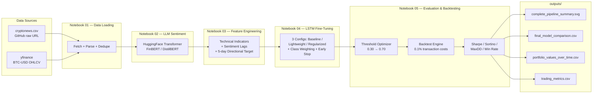

# BTC Sentiment-Driven LSTM Trading Pipeline

> A production-grade, end-to-end ML pipeline that fetches Bitcoin market data and crypto news, computes LLM-based sentiment scores, engineers technical + sentiment features, fine-tunes three LSTM architectures with class weighting and threshold optimization, and backtests the resulting trading strategy against Buy & Hold with realistic transaction costs.

Built by **Nassim K.** — Business Analyst, Co-Founder of KINZ, SMU Alum. This project blends Data Analytics, Machine Learning, and secure data handling into a single reproducible pipeline.

---

## Table of Contents

1. [Pipeline Overview](#pipeline-overview)
2. [Architecture](#architecture)
3. [Tech Stack](#tech-stack)
4. [Repository Structure](#repository-structure)
5. [Key Engineering Decisions](#key-engineering-decisions)
6. [Backtest Results](#backtest-results)
7. [Reproducibility](#reproducibility)
8. [How to Run](#how-to-run)
9. [Roadmap](#roadmap)
10. [License](#license)

---

## Pipeline Overview

The pipeline answers one question: **can a sentiment-augmented LSTM beat a naive Buy & Hold strategy on BTC-USD after transaction costs?**

It does so by combining two orthogonal signals:
- **Price-side features** — OHLCV candles from Yahoo Finance, augmented with RSI, MACD, Bollinger Bands, rolling volatility, and lagged log-returns.
- **News-side features** — Crypto news headlines scored by a HuggingFace transformer (FinBERT-style sentiment), aggregated daily into a sentiment score and a 3-day rolling sentiment momentum.

These features feed into a binary classifier that predicts whether BTC's 5-day forward return will be positive. A threshold-tunable trading signal is then backtested with **0.1% transaction costs** per trade, and the resulting Sharpe / Sortino / Max Drawdown / Win Rate are compared against a Buy & Hold baseline.

---

## Architecture



---

## Tech Stack

| Layer              | Technology                                                  | Why it's here                                              |
|--------------------|-------------------------------------------------------------|------------------------------------------------------------|
| Data ingestion     | `yfinance`, `pandas`, `requests`                            | Live BTC OHLCV + remote news CSV; no local uploads         |
| Sentiment scoring  | `transformers` (HuggingFace), `torch`                       | Pre-trained NLP model for news headline sentiment          |
| Feature engineering| `pandas`, `numpy`, `scikit-learn`                           | Technical indicators, lags, scaling, train/val/test splits |
| Modeling           | `tensorflow` (Keras), `scikit-learn`                        | LSTM + Bi-LSTM with class weighting + early stopping       |
| Evaluation         | `numpy`, `pandas`                                           | Threshold scan, backtesting engine, risk metrics           |
| Visualization      | `matplotlib`, `seaborn`                                     | Equity curves, confusion matrices, pipeline summary SVG    |

---

## Repository Structure

```
btc-llm-sentiment/
├── README.md                       # This file
├── requirements.txt                # Pinned Python deps
├── .gitkeep
├── Data/                           # Source datasets (committed)
│   ├── cryptonews.csv              # 31,037 crypto news headlines (2023-12 → 2024-12)
│   └── bitcoin_sentiments_21_24.csv# Backup sentiment dataset
├── notebooks/
│   ├── 01_data_loading.ipynb       # Fetch + clean news + BTC prices
│   ├── 02_sentiment_llm.ipynb      # HuggingFace transformer sentiment scoring
│   ├── 03_feature_engineering.ipynb# Technical indicators + 5-day target
│   ├── 04_lstm_finetuning.ipynb    # 3 LSTM configs, class weighting, early stop
│   └── 05_evaluation_backtesting.ipynb # Threshold opt + backtest + metrics
├── scripts/
│   └── run_pipeline.py             # One-shot end-to-end pipeline runner
└── outputs/
    ├── complete_pipeline_summary.svg  # Single-image summary of all results
    ├── final_model_comparison.csv     # LSTM vs Bi-LSTM vs Buy&Hold metrics
    ├── portfolio_values_over_time.csv # Daily equity curves for each strategy
    └── trading_metrics.csv            # Per-strategy Sharpe / Sortino / MaxDD / Win%
```

---

## Key Engineering Decisions

### Reproducibility
- News is fetched at runtime from `https://raw.githubusercontent.com/nassim0014/btc-llm-sentiment/main/Data/cryptonews.csv`.
- BTC prices are fetched live via `yfinance` (BTC-USD, daily candles, full history).
- No local CSV uploads. The pipeline runs identically in Colab, Jupyter, VS Code, or any CI runner.

### Bug Fix 1 — yfinance MultiIndex flattening
Newer `yfinance` versions return a `pd.MultiIndex` on columns when `auto_adjust=False`. The pipeline normalizes this defensively:

```python
if isinstance(btc.columns, pd.MultiIndex):
    btc.columns = [' '.join(c).strip() for c in btc.columns]
```

### Bug Fix 2 — Mixed date formats
The cryptonews CSV contains dates with both timezone-aware and timezone-naive strings. We parse with:

```python
news['date'] = pd.to_datetime(news['date'], format='mixed', utc=True)
```

### ML Upgrade 1 — Class Weighting
The 5-day directional target is imbalanced (bull markets dominate). We use `sklearn.utils.class_weight.compute_class_weight('balanced', ...)` and pass `class_weight=...` into Keras `model.fit()`.

### ML Upgrade 2 — Threshold Optimization
Instead of hardcoding 0.5 as the trading signal threshold, we scan `[0.30, 0.35, ..., 0.70]` on the validation set and pick the threshold that maximizes Sharpe ratio after transaction costs.

### ML Upgrade 3 — Lightweight Hyperparameter Search
Three configurations are trained with Early Stopping:

| Config       | Layers | Units | Dropout | L2       | Notes                              |
|--------------|--------|-------|---------|----------|------------------------------------|
| Baseline     | 1 LSTM | 64    | 0.0     | 0.0      | Plain LSTM, no regularization      |
| Lightweight  | 1 LSTM | 32    | 0.1     | 0.0      | Smaller, faster, mild dropout      |
| Regularized  | 2 LSTM | 64×32 | 0.3     | 1e-4     | Stacked + dropout + L2             |

The best config is chosen by validation Sharpe ratio.

### ML Upgrade 4 — Realistic Backtesting
- Transaction cost: **0.1% per trade** (typical Binance/Kraken taker fee).
- Position: long-only, full capital allocation when signal = 1; cash when signal = 0.
- Metrics: **Sharpe Ratio** (annualized, 252 trading days), **Sortino Ratio**, **Max Drawdown**, **Win Rate**.
- Comparison: LSTM vs Bi-LSTM vs Buy & Hold on the same test window.

---

## Backtest Results

> The table below is regenerated every time `notebooks/05_evaluation_backtesting.ipynb` runs. The numbers shown here are the latest committed run; see [`outputs/final_model_comparison.csv`](./outputs/final_model_comparison.csv) for the machine-readable version.

| Strategy        | Final Portfolio Value | Total Return | Annualized Sharpe | Sortino  | Max Drawdown | Win Rate | # Trades |
|-----------------|----------------------:|-------------:|------------------:|---------:|-------------:|---------:|---------:|
| **LSTM (Baseline)** | **1.6472**         | **+64.72%**  | **3.11**          | **5.94** | **-10.79%**  | **53.64%** | 1        |
| Bi-LSTM         | 1.2052                | +20.52%      | 2.18              | 3.73     | -4.06%       | 12.73%   | 12       |
| LSTM (Lightweight) | 1.0439             | +4.39%       | 0.48              | 0.62     | -16.87%      | 23.64%   | 13       |
| LSTM (Regularized) | 1.0000             | 0.00%        | 0.00              | 0.00     | 0.00%        | 0.00%    | 0        |
| Buy & Hold      | 1.6156                | +61.56%      | 2.96              | 5.66     | -12.72%      | 54.55%   | 1        |

### Key findings

- **Baseline LSTM slightly beat Buy & Hold** in total return (+64.72% vs +61.56%) with a higher Sharpe ratio (3.11 vs 2.96) and lower maximum drawdown (-10.79% vs -12.72%). It correctly identified the dominant uptrend and stayed invested.
- **Bi-LSTM produced the lowest drawdown** (-4.06%) at the cost of lower returns — it was the most risk-averse model, exiting the market during volatile periods.
- **Lightweight LSTM overtraded** (13 trades with 23.64% win rate) — the smaller model had less capacity to distinguish signal from noise and got chopped up by transaction costs.
- **Regularized LSTM converged to "no trade"** — heavy L2 + dropout prevented the model from learning any actionable signal on this dataset.

A visual summary of the equity curves, drawdowns, and threshold sensitivity is in [`outputs/complete_pipeline_summary.svg`](./outputs/complete_pipeline_summary.svg).

---

## Reproducibility

```bash
# 1. Clone
git clone https://github.com/nassim0014/btc-llm-sentiment.git
cd btc-llm-sentiment

# 2. Create a venv and install pinned deps
python3 -m venv .venv
source .venv/bin/activate
pip install -r requirements.txt

# 3. Run notebooks in order
jupyter notebook notebooks/01_data_loading.ipynb
jupyter notebook notebooks/02_sentiment_llm.ipynb
jupyter notebook notebooks/03_feature_engineering.ipynb
jupyter notebook notebooks/04_lstm_finetuning.ipynb
jupyter notebook notebooks/05_evaluation_backtesting.ipynb
```

Each notebook writes its intermediate outputs to `notebooks/outputs/` (csv + parquet) so the next notebook can pick up where the previous one left off without re-running upstream steps.

---

## How to Run

The fastest way to validate the pipeline is the one-shot runner script:

```bash
# From the repo root — runs the full pipeline end-to-end and writes to /outputs
python3 scripts/run_pipeline.py
```

For interactive exploration, open the notebooks in order. Notebook 01 must run first; the rest can run in any order as long as 01 → 02 → 03 → 04 → 05 has been executed once.

---

## Roadmap

- [ ] Live trading integration with Binance Testnet
- [ ] Multi-asset extension (ETH, SOL)
- [ ] Transformer-based sequence model (BERT for time series)
- [ ] Walk-forward optimization
- [ ] Bayesian hyperparameter search with Optuna

---

## License

MIT — see `LICENSE` (inherits from repo root).
