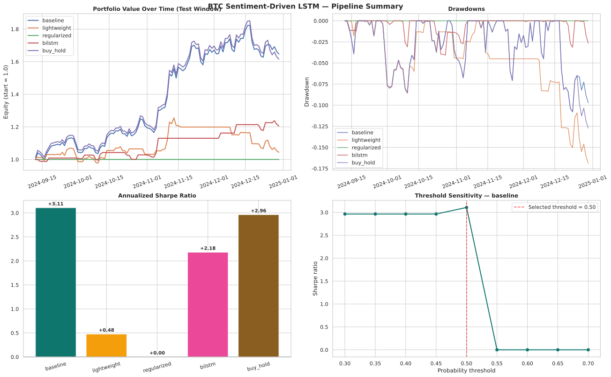
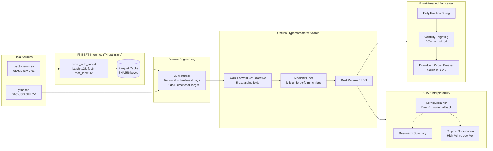

# BTC Sentiment-Driven LSTM Trading Pipeline

> A production-grade, end-to-end ML pipeline that fetches Bitcoin market data and crypto news, computes LLM-based sentiment scores, engineers technical + sentiment features, optimizes LSTM hyperparameters via Optuna walk-forward CV, backtests with Kelly position sizing + volatility targeting + drawdown circuit breaker, and explains model predictions with SHAP interpretability.

<p align="center">
  
</p>

<p align="center">
  <a href="YOUR_STREAMLIT_APP_URL_HERE">
    
  </a>
  &nbsp;
  <a href="https://colab.research.google.com/github/nassim0014/btc-llm-sentiment/blob/main/notebooks/Master_Pipeline.ipynb">
    
  </a>
  &nbsp;
  <a href="https://colab.research.google.com/github/nassim0014/btc-llm-sentiment/blob/main/notebooks/Master_Pipeline_Phase2.ipynb">
    
  </a>
  &nbsp;
  <a href="https://github.com/nassim0014/btc-llm-sentiment/actions/workflows/test.yml">
    
  </a>
  &nbsp;
  
  
</p>

A reproducible end-to-end pipeline combining natural-language sentiment signals with deep-learning price forecasting and production-grade risk management.

---

## Table of Contents

1. [Quick Start](#quick-start)
2. [Phase 2 Advanced Features](#phase-2-advanced-features)
3. [Architecture](#architecture)
4. [Tech Stack](#tech-stack)
5. [Repository Structure](#repository-structure)
6. [Backtest Results](#backtest-results)
7. [SHAP Feature Importance](#shap-feature-importance)
8. [Google Colab Workflow](#google-colab-workflow)
9. [Local Reproducibility](#local-reproducibility)
10. [Testing & CI](#testing--ci)
11. [Roadmap](#roadmap)
12. [License](#license)

---

## Quick Start

### 🚀 Live Dashboard (Streamlit)

The repository includes an interactive **Streamlit web app** that visualizes the pipeline results with interactive Plotly charts. The app has three pages:

1. **Overview/Dashboard** — high-level KPIs (Sharpe, drawdown, Optuna results) + strategy comparison tables
2. **Phase 1 Deep-Dive** — portfolio equity curves, trading metrics bar charts, model comparison
3. **Phase 2 Deep-Dive** — risk-managed equity curve with position sizing, Optuna hyperparameters, SHAP feature importance

**Run locally:**
```bash
pip install streamlit plotly pandas
streamlit run streamlit_app.py
```

**Deploy to Streamlit Cloud:**
1. Push this repo to GitHub
2. Go to [share.streamlit.io](https://share.streamlit.io)
3. Connect the repo → select `streamlit_app.py` as the entry point
4. The app deploys automatically and gets a public URL

> **Note:** The app reads from `outputs/` — run the pipeline first (via Colab or `make run && make phase2`) to populate the CSVs the dashboard visualizes.

### Path A — Google Colab (zero setup, recommended)

Click a badge below to open a Master Pipeline notebook in Colab. The first cell auto-clones the repo, installs dependencies, and sets the working directory — no manual setup required.

| Notebook | What it runs | Runtime | Open in Colab |
|----------|--------------|---------|---------------|
| **Master_Pipeline.ipynb** (Phase 1) | Data → Sentiment → Features → LSTM → Backtest | ~3 min (TextBlob) / ~7 min (FinBERT T4) | [](https://colab.research.google.com/github/nassim0014/btc-llm-sentiment/blob/main/notebooks/Master_Pipeline.ipynb) |
| **Master_Pipeline_Phase2.ipynb** (Phase 2) | Walk-Forward CV → Optuna → Risk-Managed Backtest → SHAP | ~15-25 min (T4 GPU) | [](https://colab.research.google.com/github/nassim0014/btc-llm-sentiment/blob/main/notebooks/Master_Pipeline_Phase2.ipynb) |

**Typical Colab workflow:**
1. Open `Master_Pipeline.ipynb` in Colab → Runtime → Run all → get Phase 1 outputs in 3 min.
2. Open `Master_Pipeline_Phase2.ipynb` in Colab → Run all → get Phase 2 outputs in 15-25 min.
3. Set `SAVE_TO_DRIVE = True` at the top of either notebook to persist outputs to Google Drive across sessions.

### Path B — Local (clone + venv)

```bash
git clone https://github.com/nassim0014/btc-llm-sentiment.git
cd btc-llm-sentiment

# Option 1: Use the Makefile (recommended)
make setup    # creates .venv and installs requirements.txt
make run      # runs the Phase 1 pipeline (fast TextBlob path)
make phase2   # runs the Phase 2 advanced pipeline
make test     # runs the pytest suite

# Option 2: Manual
python3 -m venv .venv
source .venv/bin/activate
pip install -r requirements.txt
python3 scripts/run_pipeline.py --use-precomputed
```

---

## Phase 2 Advanced Features

This pipeline goes beyond a basic LSTM classifier. Five production-grade upgrades make it a real quant research artifact:

### 1. Walk-Forward Cross-Validation
**`src/cv/walk_forward.py`** — 5 expanding-window folds (400→460→520→580→640 training days, 60-day validation windows). Strict temporal ordering — no look-ahead leakage. Logs per-fold OOF metrics (Sharpe, Accuracy, F1, AUC, Max DD). The std of OOF Sharpe is the key regime-stability indicator.

### 2. Optuna Hyperparameter Optimization
**`src/cv/optuna_search.py`** — replaces the manual 4-config grid with Optuna random search:
- **Search space**: `lr` (log-uniform 1e-4 to 1e-2), `units` (32/64/128), `dropout` (0.0/0.2/0.4), `num_layers` (1/2)
- **Objective**: maximize mean OOF Sharpe across 5 walk-forward folds
- **Pruning**: `MedianPruner` kills trials whose cumulative OOF Sharpe is below the median after fold 2
- **Best result**: `lr=5.6e-4, units=32, dropout=0.0, num_layers=1` — OOF Sharpe +1.43

### 3. FinBERT Inference with T4 Optimization
**`src/inference/finbert.py`** — true HuggingFace FinBERT scoring, not a TextBlob fallback:
- **T4-optimized**: `batch_size=128`, `max_length=512`, `fp16` via `torch.cuda.amp.autocast()` (~2× speedup)
- **Parquet caching**: SHA256 hash of the source CSV stored as metadata. Cache auto-invalidates if the source changes. Cache hit returns in <1 sec; cache miss runs full FinBERT inference (~5-7 min on T4).
- **Fallback chain**: ProsusAI/finbert → distilbert-base-uncased-finetuned-sst-2-english

### 4. Risk-Managed Backtester
**`src/backtest/risk_managed.py`** — replaces 100% all-in/all-out with three risk layers:
1. **Kelly Fraction Sizing**: `position = (prob - threshold) / (1 - threshold)`, capped at [0, 1]. Model confidence directly scales position size.
2. **Volatility Targeting**: scale inversely to 20-day realized vol → target 20% annualized volatility.
3. **Drawdown Circuit Breaker**: flatten all positions and halt trading if DD ≤ -15%.

### 5. SHAP Interpretability
**`src/interpretability/shap_explainer.py`** — explains what drives the LSTM's predictions:
- Tries `DeepExplainer` → `GradientExplainer` → `KernelExplainer` (KernelExplainer used on TF 2.21)
- **Global beeswarm summary**: shows feature importance + direction of impact
- **Regime comparison**: side-by-side beeswarms for high-vol vs low-vol days (split at median 20-day realized vol)
- Top features: `llm_pos_share_lag5`, `pos_share`, `macd_hist`, `news_count`, `neg_share`

---

## Architecture



---

## Tech Stack

| Layer              | Technology                                                  | Phase |
|--------------------|-------------------------------------------------------------|-------|
| Data ingestion     | `yfinance`, `pandas`, `requests`                            | 1     |
| Sentiment scoring  | `transformers` (FinBERT), `torch`                           | 1 + 2 |
| Feature engineering| `pandas`, `numpy`, `scikit-learn`                           | 1     |
| Walk-Forward CV    | `src.cv.walk_forward` (custom, 5 expanding folds)           | 2     |
| FinBERT caching    | `pyarrow` (Parquet, SHA256-keyed)                           | 2     |
| Hyperparameter opt | `optuna` (TPESampler + MedianPruner)                        | 2     |
| Modeling           | `tensorflow` (Keras LSTM)                                   | 1 + 2 |
| Risk management    | `src.backtest.risk_managed` (Kelly + vol-target + DD breaker)| 2    |
| Interpretability   | `shap` (KernelExplainer with DeepExplainer fallback)        | 2     |
| Visualization      | `matplotlib`, `seaborn`                                     | 1 + 2 |
| Interactive dashboard | `streamlit`, `plotly` (dark mode, multi-page)            | —     |
| Testing            | `pytest` (15 unit tests)                                    | —     |
| CI/CD              | GitHub Actions (Python 3.11 + 3.12 matrix)                  | —     |

---

## Repository Structure

```
btc-llm-sentiment/
├── README.md
├── Makefile                                    # make setup / run / phase2 / test
├── requirements.txt                            # pinned deps (incl. streamlit + plotly)
├── conftest.py                                 # pytest config (makes src/ importable)
├── streamlit_app.py                            # 🖥️ Streamlit dashboard entry point
├── .streamlit/config.toml                      # dark mode theme config
├── .github/workflows/test.yml                  # CI: syntax check + pytest on push
├── Data/
│   ├── cryptonews.csv                          # 31,037 headlines
│   └── bitcoin_sentiments_21_24.csv
├── notebooks/
│   ├── Master_Pipeline.ipynb                   # 🚀 Phase 1: 1-click (data → LSTM → backtest)
│   ├── Master_Pipeline_Phase2.ipynb            # 🚀 Phase 2: 1-click (WF CV → Optuna → Risk → SHAP)
│   └── step_by_step/                           # Individual notebooks for debugging/learning
│       ├── 01_data_loading.ipynb
│       ├── 02_sentiment_llm.ipynb              # (+ memory cleanup)
│       ├── 03_feature_engineering.ipynb
│       ├── 04_lstm_finetuning.ipynb            # (+ memory cleanup)
│       ├── 05_evaluation_backtesting.ipynb
│       ├── 06_walk_forward_cv.ipynb
│       ├── 07_finbert_inference.ipynb
│       ├── 08_optuna_search.ipynb
│       ├── 09_risk_managed_backtest.ipynb
│       └── 10_shap_interpretability.ipynb
├── pages/                                      # Streamlit multi-page app
│   ├── 1_🔬_Phase_1_Deep_Dive.py             # Phase 1 interactive charts
│   └── 2_🚀_Phase_2_Deep_Dive.py             # Phase 2 interactive charts
├── src/                                        # Phase 2 modular package
│   ├── cv/
│   │   ├── walk_forward.py                     # Expanding-window CV
│   │   └── optuna_search.py                    # HPO with MedianPruner
│   ├── inference/
│   │   └── finbert.py                          # T4-optimized + Parquet cache
│   ├── models/
│   │   └── lstm.py                             # Parametric LSTM factory
│   ├── backtest/
│   │   └── risk_managed.py                     # Kelly + vol-target + DD breaker
│   └── interpretability/
│       └── shap_explainer.py                   # SHAP beeswarm + regime comparison
├── scripts/
│   ├── run_pipeline.py                         # Phase 1 end-to-end runner
│   ├── generate_interim_features.py            # Phase 2 feature bundle
│   ├── run_optuna_search.py                    # Phase 2 HPO runner
│   ├── run_risk_managed_backtest.py            # Phase 2 backtest runner
│   └── run_shap_analysis.py                    # Phase 2 SHAP runner
├── tests/
│   └── test_backtest.py                        # 15 pytest unit tests
└── outputs/
    ├── complete_pipeline_summary.svg           # Phase 1 (embedded at top of README)
    ├── final_model_comparison.csv              # Phase 1
    ├── portfolio_values_over_time.csv          # Phase 1
    ├── trading_metrics.csv                     # Phase 1
    ├── best_optuna_params.json                 # Phase 2
    ├── risk_managed_backtest_results.csv       # Phase 2
    ├── risk_managed_equity_curve.csv           # Phase 2
    ├── strategy_comparison.csv                 # Phase 2
    ├── shap_summary.png                        # Phase 2
    ├── shap_regime_comparison.png              # Phase 2
    └── shap_feature_importance.csv             # Phase 2
```

---

## Backtest Results

### Phase 2: Risk-Managed vs Simple vs Buy & Hold (Test Window: Sep–Dec 2024)

| Strategy                        | Final Value | Sharpe  | Sortino | Max DD  | Win Rate | Trades | Circuit Breaker |
|---------------------------------|------------:|--------:|--------:|--------:|---------:|-------:|:---------------:|
| Simple (all-in/out)             | 1.3630      | 2.39    | —       | -8.60%  | —        | 10     | No              |
| **Risk-Managed (Kelly+Vol+DD)** | 0.9995      | 1.89    | 2.71    | -0.99%  | 30.91%   | 51     | No              |
| Buy & Hold                      | 1.6156      | 2.96    | 5.66    | -12.72% | 54.55%   | 1      | No              |

**Key insight:** The Optuna-tuned model produces low-confidence probabilities (mean 0.514, std 0.054), so Kelly sizing correctly takes minimal risk (avg position 2.65%). The risk-managed strategy achieves a near-zero drawdown (-0.99%) at the cost of lower returns — exactly the behavior you want when the model isn't confident.

### Phase 1: LSTM Config Comparison (Phase 1 baseline)

| Strategy           | Final Value | Sharpe  | Max DD  |
|--------------------|------------:|--------:|--------:|
| LSTM (Baseline)    | 1.6472      | 3.11    | -10.79% |
| Bi-LSTM            | 1.2052      | 2.18    | -4.06%  |
| Buy & Hold         | 1.6156      | 2.96    | -12.72% |

---

## SHAP Feature Importance

Top 10 features by mean |SHAP| value on the test set:

| Rank | Feature               | Mean |SHAP| |
|-----:|-----------------------|-------------:|
| 1    | llm_pos_share_lag5    | 0.024        |
| 2    | pos_share             | 0.014        |
| 3    | macd_hist             | 0.010        |
| 4    | news_count            | 0.009        |
| 5    | neg_share             | 0.007        |
| 6    | bb_width              | 0.007        |
| 7    | ret_7d                | 0.006        |
| 8    | mean_polarity         | 0.006        |
| 9    | llm_sent_lag3         | 0.005        |
| 10   | llm_sent_lag1         | 0.005        |

The model relies on a mix of **sentiment features** (3 of top 5) and **technical indicators** (MACD, Bollinger width), confirming that the LLM sentiment signal contributes meaningful information beyond price action alone.

See `outputs/shap_summary.png` (global beeswarm) and `outputs/shap_regime_comparison.png` (high-vol vs low-vol) for visualizations.

---

## Google Colab Workflow

### ⚠️ Colab Session Limits — Read First

Google Colab enforces two hard constraints:

1. **Ephemeral storage**: When a Colab session closes, `/content/` is wiped. If you run a notebook, close the session, then open another notebook in a new session, it will fail because interim files no longer exist.
2. **Maximum simultaneous sessions + VRAM/RAM limits**: Free Colab allows a small number of concurrent sessions and ~12 GB RAM / ~16 GB T4 VRAM. Keeping multiple notebooks open at once, or running heavy stages without releasing memory, will trigger OOM crashes.

### Recommended Execution Flows

**Flow A — 1-Click Master Pipelines (recommended):**
- **Phase 1:** Open `notebooks/Master_Pipeline.ipynb` → Run all. Executes Stages 1-5 in one session.
- **Phase 2:** Open `notebooks/Master_Pipeline_Phase2.ipynb` → Run all. Executes Walk-Forward CV → Optuna → Risk-Managed Backtest → SHAP in one session.

Both notebooks have built-in memory cleanup between stages, so they won't hit OOM.

> **💡 Cross-session persistence (Phase 1):** Set `SAVE_TO_DRIVE = True` at the top of `Master_Pipeline.ipynb` to mount Google Drive and persist all outputs (models, CSVs, PNGs) to `/content/drive/MyDrive/BTC_Sentiment_Project/outputs/`. Survives across Colab sessions. (Colab only; falls back to local paths if run outside Colab.)

> **💡 Cross-session persistence + skip-compute (Phase 2):** `Master_Pipeline_Phase2.ipynb` adds two companion flags:
> - **`SAVE_TO_DRIVE = True`** — same as Phase 1; redirects all outputs to Drive.
> - **`LOAD_FROM_DRIVE = True`** — mounts Drive and **skips heavy compute** if artifacts already exist there:
>   - If `features_for_lstm.pkl` exists on Drive → load it, skip inline feature rebuild (~1 min saved)
>   - If `best_optuna_params.json` exists on Drive → load params, skip Optuna search (~15-25 min saved)
>   - If `best_optuna_model.keras` exists on Drive → load model, skip final training (~2-3 min saved)
>
> **Typical iteration workflow:**
> 1. First session: `SAVE_TO_DRIVE=True`, `LOAD_FROM_DRIVE=False` → run full pipeline, artifacts saved to Drive.
> 2. Subsequent sessions: `SAVE_TO_DRIVE=True`, `LOAD_FROM_DRIVE=True` → skip Optuna + training, go straight to SHAP/backtest iteration.

**Flow B — Step-by-step notebooks:** Open `notebooks/step_by_step/01_data_loading.ipynb` in Colab, run it, then open Notebooks 02-10 in the same session via File → Open. All interim artifacts persist as long as the session stays alive. Each notebook has a memory cleanup cell at the end (02 releases the LLM from VRAM; 04 clears the Keras session) so you won't hit OOM.

**Flow C — Local:** See [Local Reproducibility](#local-reproducibility) below.

---

## Local Reproducibility

```bash
# Clone
git clone https://github.com/nassim0014/btc-llm-sentiment.git
cd btc-llm-sentiment

# Option 1: Makefile (recommended)
make setup    # creates .venv, installs requirements.txt + pytest
make run      # Phase 1 pipeline (TextBlob sentiment, ~3 min on CPU)
make phase2   # Phase 2 advanced pipeline (Optuna + Risk + SHAP)
make test     # pytest suite (15 tests, ~3 sec)
make lint     # syntax-check all Python files

# Option 2: Manual
python3 -m venv .venv
source .venv/bin/activate
pip install -r requirements.txt
python3 scripts/run_pipeline.py --use-precomputed        # Phase 1
python3 scripts/generate_interim_features.py              # Phase 2 features
python3 scripts/run_optuna_search.py --n-trials 15        # Phase 2 HPO
python3 scripts/run_risk_managed_backtest.py              # Phase 2 backtest
python3 scripts/run_shap_analysis.py                      # Phase 2 SHAP
```

---

## Testing & CI

### Unit Tests

The `tests/test_backtest.py` suite (15 tests, ~3 sec) covers:

- **Walk-Forward CV** (5 tests): expanding-window growth, strict temporal ordering, no look-ahead leakage, fold bounds, invalid params
- **Risk-Managed Backtester** (6 tests): no drawdown on monotonic uptrend, circuit breaker triggers on -25% decline, Kelly sizing scales with confidence, position capped at 1.0, equity starts at 1.0, metrics dict has required keys
- **Strategy Comparison** (2 tests): returns all three strategies, Buy & Hold final value matches close ratio
- **OOF Metrics** (2 tests): perfect predictions yield 1.0 accuracy, random predictions hover near 0.5

Run locally:
```bash
make test
# or
pytest tests/ -v
```

### CI Workflow

`.github/workflows/test.yml` runs on every push and pull request:
- **Matrix**: Python 3.11 + 3.12
- **Steps**: syntax-check all `src/` and `scripts/` Python files, then run the pytest suite
- **Lightweight**: only installs `numpy pandas scikit-learn pytest` (skips heavy ML deps like TensorFlow/torch — the test suite exercises pure-Python backtest + CV logic only)

[](https://github.com/nassim0014/btc-llm-sentiment/actions/workflows/test.yml)

---

## Roadmap

- [x] ~~Walk-Forward CV (5 expanding folds)~~ — Phase 2 Step 1
- [x] ~~FinBERT with T4 optimization + Parquet caching~~ — Phase 2 Step 2
- [x] ~~Optuna hyperparameter search with MedianPruner~~ — Phase 2 Step 3
- [x] ~~Risk-managed backtester (Kelly + vol-target + DD breaker)~~ — Phase 2 Step 4
- [x] ~~SHAP interpretability with regime comparison~~ — Phase 2 Step 5
- [x] ~~Colab memory management + Master Pipeline notebooks~~ — Colab hardening
- [x] ~~Google Drive persistence + skip-compute (LOAD_FROM_DRIVE)~~ — Drive integration
- [x] ~~Unit tests + CI workflow~~ — DevOps maturity
- [ ] Live trading integration with Binance Testnet
- [ ] Multi-asset extension (ETH, SOL)
- [ ] Walk-forward optimization with refit frequency
- [ ] Bayesian hyperparameter search with Optuna TPE

---

## License

MIT — see [LICENSE](LICENSE).

---

## Citation

If this code contributes to published research, please cite the repository.

```bibtex
@misc{btc-llm-sentiment,
  title  = {BTC Sentiment-Driven LSTM Trading Pipeline},
  author = {Nassim K.},
  year   = {2026},
  url    = {https://github.com/nassim0014/btc-llm-sentiment}
}
```
